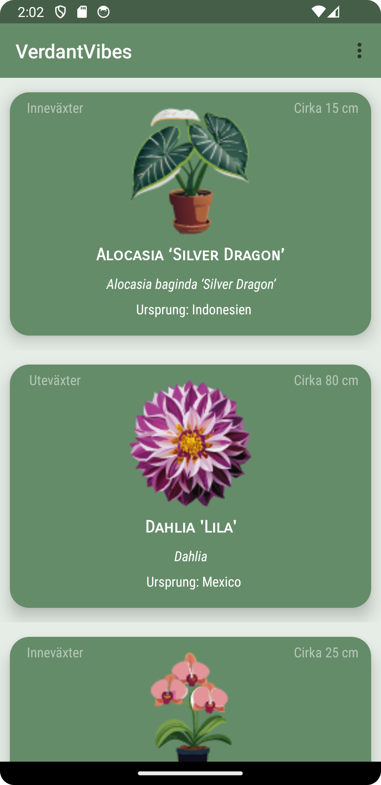
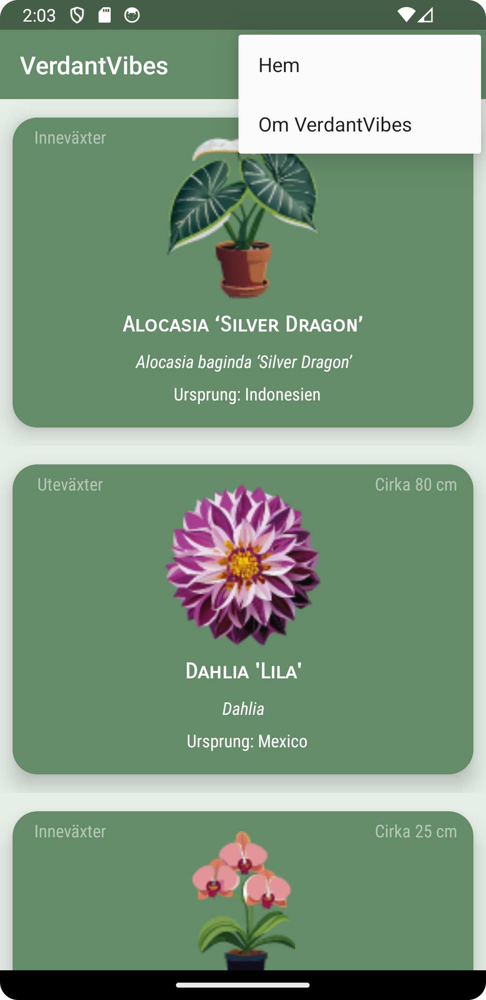
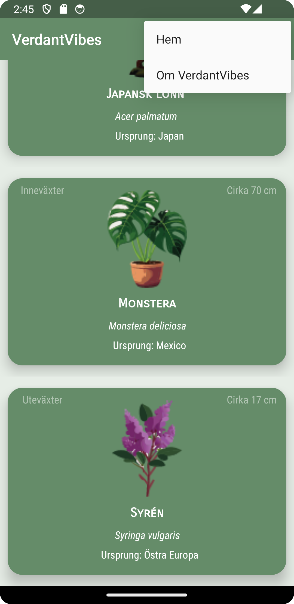

# Rapport - Implementationsexempel

A class named Plant is created to store the JSON data. To show the data, a recyclerview adapter is created where all of the data is connected to the layout file "plant_item.xml" via viewholder and written out with help of onBindViewHolder.
```
    @Override
    @NonNull
    public ViewHolder onCreateViewHolder(@NonNull ViewGroup parent, int viewType) {
        return new ViewHolder(layoutInflater.inflate(R.layout.plant_item, parent, false));
    }

    @Override
    public void onBindViewHolder(ViewHolder holder, int position) {
        Plants plant = items.get(position);
        holder.name.setText(plant.getName());
        holder.company.setText(plant.getCompany());
        holder.category.setText(plant.getCategory());
        holder.location.setText("Ursprung: " + plant.getLocation());
        // Set centimeter
        holder.centimeter.setText(String.valueOf("Cirka " + plant.getCentimeter()) + " cm");

        // Load plant photo from assets folder
        try {
            InputStream inputStream = context.getAssets().open(plant.getPlantPhoto());
            Drawable drawable = Drawable.createFromStream(inputStream, null);
            holder.plantPhoto.setImageDrawable(drawable);
        } catch (IOException e) {
            e.printStackTrace();
        }
    }
```

```
        ViewHolder(View itemView) {
            super(itemView);
            itemView.setOnClickListener(this);
            name = itemView.findViewById(R.id.plant_title);
            company = itemView.findViewById(R.id.plant_latin);
            location = itemView.findViewById(R.id.plant_location);
            category = itemView.findViewById(R.id.plant_category);
            centimeter = itemView.findViewById(R.id.plant_size);
            plantPhoto = itemView.findViewById(R.id.plant_image);
        }
```

The JSON data is being initiated with an url and is being read by Gson.
To create all of the objects from the JSON data, an arraylist is created that's called "listOfPlants" where each individual plant gets added in in onPostExecute.

```
    private final String JSON_URL = "https://mobprog.webug.se/json-api?login=b23johgu";

    private Plants[] plants;
    Gson gson = new Gson();
    ArrayList<Plants> items = new ArrayList<>();
    RecyclerViewAdapter adapter;
```

```
    @Override
    public void onPostExecute(String json) {
        Type type = new TypeToken<List<Plants>>() {}.getType();
        List<Plants> listOfPlants = gson.fromJson(json, type);

        items.addAll(listOfPlants);
        adapter.notifyDataSetChanged();
    }
}
```


A second activity is created to be used as an "about" page for the app.
[AboutActivity.java](AboutActivity.java)
[activity_about.xml](activity_about.xml)

A toolbar menu is created with two options to navigate in the app, "Hem" and "Om VerdantVibes".
```
<menu xmlns:android="http://schemas.android.com/apk/res/android">

    <item android:title="@string/hem"
        android:id="@+id/home"/>

    <item android:title="@string/om_gardenglow"
        android:id="@+id/about_us"/>
</menu>
```

To navigate to the different activities an Intent is added to both activities. This is from MainActivity, the java in AboutActivity looks exactly the same except the intent is placed under "case R.id.home" instead of ""case R.id.about_us"
```
    @Override
    public boolean onOptionsItemSelected(@NonNull MenuItem item) {
        switch (item.getItemId()) {
            case R.id.home:

                break;
            case R.id.about_us:
                Intent intent = new Intent(MainActivity.this, AboutActivity.class);
                startActivity(intent);
                break;
            default:
                break;
        }
        return true;
    }
```





The second activity has a text that describes what the app is used for to reach the target group and a rating bar to rate the app.


